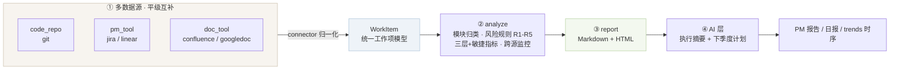

# git-pm-harness

> 把 AI 放进项目管理的**每一个环节**：采集 → 分析 → 报告 → 复盘建议。
> 项目的全部事实来自真实数据源（git 提交历史 + 可选的 Jira/Linear、Confluence/Google Doc），
> AI 只做「从数据到决策」的那层转化。
>
> 目的只有一个：**提效**（不用手工统计）、**提高准确性**（每条结论可溯源）、**提高可预测性**（趋势可对比）。


---

## 目录

- [为什么做这个](#为什么做这个)
- [它是怎么运转的](#它是怎么运转的)
- [AI 在哪些环节发挥作用](#ai-在哪些环节发挥作用)
- [快速开始](#快速开始)
- [示例：一次真实运行的输出](#示例一次真实运行的输出)
- [使用](#使用)
- [指标口径（诚实版）](#指标口径诚实版)
- [PMBOK 绩效域 × 数据支撑度](#pmbok-绩效域--数据支撑度)
- [扩展一个新数据源](#扩展一个新数据源)
- [项目结构](#项目结构)
- [路线图](#路线图)

---

## 为什么做这个

AI 写代码的能力已经不缺，缺的是**让 AI 在「管理」这件事上稳定发挥的载体**。大多数团队用 AI 做项目管理，
仍然停留在「打开一个对话框，把数据粘进去问一句」——数据要手工汇总、结论无法复现、下次还得重来一遍。

这个 harness 想把这件事沉淀成一套**可重复运行的机制**，回答三个问题：

| 想要的结果 | 传统痛点 | 本 harness 的做法 |
| --- | --- | --- |
| **提效** | 周报/复盘要手工翻 commit、抄进度、拼 PPT | 一条命令（或每天定时）自动产出 PM 报告与日报，覆盖数据采集→分析→成文全链路 |
| **提高准确性** | AI 凭印象写总结，数字对不上、结论不可验证 | 所有指标都由脚本从原始数据算出，**每条风险都带 commit hash 作为证据**；缺数据的部分诚实标注「需接入 XX 源」，**绝不编造** |
| **提高可预测性** | 每次汇报都是「此刻快照」，看不出趋势，无法预警 | `daily_run` 维护 `trends.json/csv` 时间序列，跟踪逃逸比、回滚数、回归信号等**领先指标**漂移，触发阈值才出完整报告 |

一个隐含前提：**不一定有 PM 工具，但一定有 git**。所以 harness 以 git 为最小可运行底座——
约定式提交（`feat/fix/security/revert…`）本身就携带了范围、质量与风险信号，无需额外工具即可起步；
当项目接入 Jira/Linear、Confluence/Google Doc 时，这些源与 git **平级互补**，报告自动升级。

---

## 它是怎么运转的

骨架直接对应 **PMBOK 监控过程组**的三段式链条——这也是它能「可信」的原因：
不是让 AI 直接读一堆原始数据然后自由发挥，而是先在脚本层把数据变成结构化信息，AI 只负责最后一层的表达与建议。



对应到 PMBOK 的术语，就是标准的**工作绩效数据 → 工作绩效信息 → 工作绩效报告**：

| 阶段 | PMBOK 术语 | 本 harness 的载体 | AI / 自动化的角色 |
| --- | --- | --- | --- |
| ① 采集 | Work Performance **Data** | `connectors/`：git / jira / linear / confluence / googledoc | 自动拉取 + 归一化，无需人工汇总 |
| ② 分析 | Work Performance **Information** | `analyze.py`：模块归类、风险规则、指标计算、跨源监控 | 规则引擎保证可复现；领域词典可配置 |
| ③ 报告 | Work Performance **Reports** | `report.py`：Markdown / 自包含 HTML | 结构化渲染，结论带 hash 证据 |
| ④ 建议 | 决策与治理 | `ai.py` + `llm/`：执行摘要 + 下季度计划 | LLM 只在**结构化信息之上**做归纳与建议 |

### 三个关键设计

**1. 多数据源分类平级互补**

| 分类 | 数据源 | 监控什么 |
| --- | --- | --- |
| `code_repo` 代码仓库 | `git` | 提交/范围/质量/风险（变动量、逃逸比、回滚） |
| `pm_tool` 项目管理 | `jira` / `linear` | **需求信息、进度、需求变更**（Story/Epic 状态流转） |
| `doc_tool` 文档工具 | `confluence` / `googledoc` | 规格/需求文档的**修订**（变更侧信号） |

- 所有 connector 把原始记录归一化成同一个 `WorkItem`，下游分析层完全不关心数据来自哪里 → **加数据源不用改分析代码**。
- 同一项目通常只用一种 `pm_tool`（Jira **或** Linear），harness 不强制，合并所有已启用且读取成功的源。
- 未配置 / 凭证缺失的源会**被跳过并在报告里说明原因**，不是静默失败，更不会编数据。

**2. LLM provider 抽象，按省钱优先级自动选**

```
shell（Claude Code / WorkBuddy 等 agentic harness，通常已有订阅）
  >  ollama（本地模型，免费、离线）
    >  openai（任意 OpenAI 兼容 API，按量计费）
```

`llm.resolve_provider()` 按 `priority` 返回**第一个可用**的 provider。三个都不可用时**降级为模板**
（摘要仍由真实数字拼装），保证 harness 永远跑得起来、报告永远有内容。

**3. 零依赖 + 零写入**

只用 Python 标准库与 `git`，不装任何第三方包；对业务仓库**只读**，不写回、不改动你的代码。

---

## AI 在哪些环节发挥作用

这是这个项目真正的着眼点——不是「用 AI 写报告」，而是把 AI 铺到管理链路的每一段：

| 环节 | 人/传统工具怎么做 | 这里怎么做 |
| --- | --- | --- |
| 数据采集 | 手工翻 commit、找 Jira、对文档 | connector 按配置自动拉取并归一化 |
| 范围分解 | 人工凭记忆划分模块 | 领域词典 + 关键词自动归类到模块（Epic 视图） |
| 质量度量 | 凭感觉说「最近 bug 有点多」 | 逃逸比 fix/feat、回归信号、回滚数自动计算 |
| 风险识别 | 复盘会上临时回想 | R1–R5 规则逐条扫，**每条都挂 commit hash 证据** |
| 跨源对账 | 人肉把需求单和提交对上 | 需求总数/完成率/变更事件 + 模块可追溯矩阵 |
| 报告成文 | 花半天拼 PPT | 一条命令产出 Markdown + HTML |
| 复盘建议 | 靠经验拍脑袋定下季度方向 | LLM 基于结构化信息产出摘要 + **可溯源到下季度计划**（每条对应一个真实风险） |
| 持续监控 | 想起来才看一次 | `daily_run` 每日趋势 + 阈值触发，指标漂移才提醒 |

> 说人话：**能被规则算出来的，就不交给 AI 猜**。AI 只用在「归纳」和「建议」这种规则写不出来的地方。

---

## 快速开始

只依赖 **Python 3.10+** 与 **git**，无第三方包。

```bash
git clone https://github.com/xuxtc/pm-harness.git
cd pm-harness

# 1) 分析任意一个 git 仓库，产出 PM 报告（Markdown + HTML）
python run.py --repo /path/to/your/repo --domain default

# 2) 纯规则模式，完全离线、无需任何 LLM
python run.py --repo /path/to/your/repo --no-ai

# 3) 多数据源演示（git + Jira + Confluence 示例数据，无需任何凭证）
python run.py --settings config/sources.demo.json --no-ai --out output-demo
```

输出：

```
output/
├── PM报告-YYYYMMDD.md      # Markdown 报告
└── PM报告-YYYYMMDD.html    # 自包含 HTML（浅色主题，可直接浏览器打开/分享）
```

想启用 AI 摘要（三选一，按上面的省钱优先级自动挑）：

```bash
ollama serve && ollama pull qwen2.5:3b   # 本地免费
# 或 export OPENAI_API_KEY=sk-...        # 按量计费，最后才用
# 或确保 claude / workbuddy 在 PATH 里    # agentic harness，优先
```

---

## 示例：一次真实运行的输出

以本仓库 + 示例 fixtures 为例（`config/sources.demo.json`，任何人不配凭证都能复现）：

```bash
python run.py --settings config/sources.demo.json --no-ai --out output-demo
```

```
[1/5] 采集数据源（按 settings.json）
       -> git=1; jira=6; confluence=3 ｜ 领域=generic
[4/5] 跳过 AI 层（--no-ai）
[5/5] 渲染报告
完成。输出：
  - md: output-demo\PM报告-20260928.md
  - html: output-demo\PM报告-20260928.html
```

生成的报告节选（真实输出，未做美化）：

```markdown
### 2.6 跨源监控（需求 / 进度 / 需求变更）

- 已接入数据源类别：code_repo, doc_tool, pm_tool
- 需求总数（PM 工具）：**5** ｜ 状态分布：{'done': 3, 'in_progress': 1, 'changed': 1, 'reopened': 1} ｜ 完成率：**0.5**
- 需求变更事件：**3** 条（DEMO-103:in_progress；DEMO-104:changed；DEMO-106:reopened）
- 文档/规格变更：**3** 条（PAGE-201；PAGE-202；PAGE-203）

**模块可追溯矩阵（PM 需求数 × git 提交数）：**

| 模块 | PM 需求 | git 提交 |
| --- | ---: | ---: |
| 测试 | 1 | 0 |
| CI / CD | 1 | 1 |
| 安全 | 2 | 0 |
```

以及风险登记段（每条风险都带证据，可直接点回提交）：

```markdown
| ID | 严重度 | 风险 | 证据(hash) | 建议 |
| --- | --- | --- | --- | --- |
| R5 | 低 | 存在大爆炸式提交（blast radius 大） | b8a3d20 改动28文件/2340+0- | 鼓励更小、单一职责的提交；大提交应拆分 PR 并附设计说明，便于 review 与 bisect。 |
```

> 只有当仓库真实具备对应信号时，才可能触发 R1–R5；示例仓库只有 1 个提交，所以只命中 R5。

---

## 使用

### 1. 一次性全量报告

```bash
python run.py --repo /path/to/repo --domain default        # 默认输出到 ./output
python run.py --repo /path/to/repo --fmt md                # 只要 Markdown
python run.py --repo /path/to/repo --no-ai                 # 不需要 LLM
python run.py --settings config/sources.demo.json          # 指定另一份数据源配置
```

### 2. 每日持续运行

```bash
python daily_run.py --repo /path/to/repo --domain default
python daily_run.py --repo /path/to/repo --force           # 忽略阈值，强制出完整报告
```

- 趋势文件 `reports/trends.json` + `trends.csv` 每天追加一条，**同日重跑只更新不重复追加（幂等）**。
- 始终产出一份轻量 `reports/DAILY-YYYY-MM-DD.md`（含与上次的 diff：提交总数、风险数、逃逸比、新增风险）。
- **阈值触发**：只有「有新提交」或「风险数漂移」时才生成完整报告，避免无变化日刷屏。

本地定时（Linux cron / Windows 任务计划程序）：

```bash
0 15 * * * cd /path/to/pm-harness && python daily_run.py --repo /path/to/repo
```

### 3. 交给 CI 每天跑

`.github/workflows/daily.yml` 已配好：每天 UTC 01:00（北京 09:00）跑一次，并把报告作为
**构建产物（artifact）**上传，保留 90 天。

> 刻意**不 commit 报告进仓库**：报告里会包含你的项目细节，公开仓库不适合留存。
> 想改成提交回仓库的话，去掉 `.gitignore` 里的 `reports/` 并给 workflow 加 `contents: write` 权限即可。

### 4. 配置

**数据源与 LLM —— `config/settings.json`**

```jsonc
{
  "domain": "default",
  "sources": {
    "git":        { "enabled": true,  "repo": "/path/to/repo", "category": "code_repo" },
    "jira":       { "enabled": false, "category": "pm_tool",
                    "base_url": "https://x.atlassian.net",
                    "email_env": "JIRA_EMAIL", "token_env": "JIRA_API_TOKEN", "project_key": "PROJ" },
    "linear":     { "enabled": false, "category": "pm_tool",
                    "api_key_env": "LINEAR_API_KEY", "team_key": "ENG" },
    "confluence": { "enabled": false, "category": "doc_tool",
                    "base_url": "https://x.atlassian.net", "token_env": "CONFLUENCE_TOKEN" },
    "googledoc":  { "enabled": false, "category": "doc_tool",
                    "creds_env": "GOOGLE_CREDS_JSON", "folder_id": "..." }
  },
  "llm": {
    "priority": ["shell", "ollama", "openai"],
    "shell":  { "engine": "claude", "command": "claude", "args": ["-p"], "model": "claude-code" },
    "ollama": { "model": "qwen2.5:3b", "base_url": "http://localhost:11434" },
    "openai": { "model": "gpt-4o-mini", "base_url": "https://api.openai.com/v1", "api_key_env": "OPENAI_API_KEY" }
  }
}
```

- 凭证一律走**环境变量**（`*_env` 字段只写变量名），仓库里不落盘任何明文 token。
- 想让某个源「不联网也能跑」，给它加 `"fixture": "config/fixtures/xxx.json"` 即可（参考 `config/sources.demo.json`）。

**领域词典 —— `config/domains/<name>.json`**

换项目只需要换一份词典，不用碰代码：

```jsonc
{
  "name": "my-project",
  "modules": {
    "api":  { "cn": "API 与接口", "en": "API & Endpoints", "keywords": ["api", "endpoint", "route"] },
    "ui":   { "cn": "前端界面",   "en": "Frontend & UI",   "keywords": ["ui", "component", "页面"] }
  },
  "rules": {
    "security_late_frac": 0.6,     // 最早的安全提交落在时间轴后 60% => 事后补丁
    "high_escape_ratio": 1.5,      // 模块逃逸比 >= 1.5 且 feat >= 2 => 质量逃逸
    "big_commit_files": 8          // 单提交改动文件数 >= 8 => 大爆炸提交
  },
  "outcome_probes": [              // Outcome 探针：正则命中即计入「结果层」交付
    { "pattern": "perf|性能|bundle", "label": "完成 {n} 项性能 / 体积优化" }
  ]
}
```

```bash
python run.py --repo /path/to/repo --domain my-project
```

---

## 指标口径（诚实版）

| 指标 | 含义 | 口径注意 |
| --- | --- | --- |
| **Churn** | 代码变动量 = 增删行数之和 | *不是*静态代码规模；高的模块「改得多」，不等于差 |
| **逃逸比** | fix 数 ÷ feat 数 | 每交付 1 个功能带出的修复数，越低越好；feat=0 时显示 `-` |
| **Velocity** | feat 数 ÷ 活跃天数 | 每活跃天交付的新功能数（敏捷速率的代理指标） |
| **Cycle time** | 平均提交间隔（天） | 节奏代理，*不是*严格的 lead time |
| **Escaped defects** | 提交描述含「回归 / regress」的信号数 | 已漏到需要修复的缺陷**代理**，*不是*线上缺陷率 |
| **完成率** | pm_tool 中 done/closed ÷ 总数 | 来自 Jira/Linear 状态流转；仅 git 时无此值 |
| **需求变更** | pm_tool 状态为 changed/reopened 或标题含变更关键词 | 跨源监控的核心信号 |

> ⚠️ 以上都是 **commit / issue 级别的代理指标**，适合做跨模块、跨时间**趋势对比**，
> 不能冒充业界标准度量（例如标准「缺陷逃逸率 = 线上缺陷 ÷ 总缺陷」）。
> 对外汇报时请连同口径一起讲。

---

## PMBOK 绩效域 × 数据支撑度

报告里的支撑度是**动态计算**的，会随接入的数据源变化——诚实标注而不是硬写：

| 绩效域 | 仅 git | 接入 pm_tool 后 |
| --- | --- | --- |
| 整合管理 | 支撑 | 支撑 |
| 范围管理 | 部分 | **支撑**（需求/Story 基准） |
| 进度管理 | 部分 | **支撑**（状态流转/关键路径） |
| 成本管理 | 需接 PM 工具 | 仍需 timesheet/ERP |
| 质量管理 | 支撑 | 支撑（+缺陷单） |
| 资源管理 | 弱 | 弱 |
| 沟通管理 | 部分 | **支撑** |
| 风险管理 | 支撑 | 支撑 |
| 采购管理 | 需接 PM 工具 | 需接 PM 工具 |
| 干系人管理 | 需接 PM 工具 | 需接 PM 工具 |

标注「需接 PM 工具」的域在 git 中确实没有原始数据——**宁可留空，也不编造**。

---

## 扩展一个新数据源

1. 在 `pm_harness/connectors/` 新建 `xxx_connector.py`，继承 `BaseConnector`，实现 `collect()` 返回 `WorkItem` 列表（设好 `category` / `kind` / `status`）。
2. 在 `pm_harness/connectors/__init__.py` 的 `REGISTRY` 里注册。
3. 在 `config/settings.json` 的 `sources` 增加该源的 `enabled` / `category` / 凭证字段。

`analyze.py` 与 `report.py` **无需改动**——它们只消费统一的 `WorkItem`。

---

## 项目结构

```
pm-harness/
├── run.py                    一键全量报告
├── daily_run.py              每日持续运行（趋势 + 阈值触发 + 幂等）
├── pm_harness/
│   ├── model.py              WorkItem 统一工作项模型
│   ├── miner.py              git 解析（connector 底层）
│   ├── connectors/           git / jira / linear / confluence / googledoc + BaseConnector
│   ├── analyze.py            模块归类 · 风险 R1-R5 · 指标 · 跨源监控 · PMBOK 矩阵
│   ├── llm/                  LLM provider 抽象（shell / ollama / openai）+ 优先级解析
│   ├── ai.py                 提示词构建 + JSON 解析 + 模板降级
│   ├── report.py             渲染层（Markdown / HTML）
│   ├── config.py             领域词典 + settings 加载
│   └── cli.py                编排入口
├── config/
│   ├── settings.json         数据源 + LLM 配置
│   ├── domains/              领域词典（default.json / sample.json）
│   ├── fixtures/             无凭证示例数据（jira.json / confluence.json）
│   └── sources.demo.json     多数据源演示配置
├── reports/                  每日运行产物（趋势 + 日报，默认 gitignore）
└── .github/workflows/daily.yml
```

---

## 路线图

- [x] 多数据源 connector（git / jira / linear / confluence / googledoc）
- [x] LLM provider 抽象（shell > ollama > openai 优先级）
- [x] 每日持续运行（趋势时序 + 阈值触发 + 幂等）
- [ ] Epic → Jira/Linear CSV 反向导出（从「复盘」升级到「规划」）
- [ ] 模块依赖图 + 就绪态聚合（status aggregation）
- [ ] 趋势可视化（sparkline / burndown）
- [ ] 周报自动投递（Slack / 邮件 / 企业微信）

---

## License

MIT © 花大牛 / xuxtc
